# Enterprise Hybrid Identity: Bridging On-Premises AD DS with Microsoft Entra ID

### ***Objective***
The core objective of this project was to architect, deploy, and validate a production-ready Hybrid Identity Lifecycle Management framework. By implementing Microsoft Entra Connect Sync, this project establishes automated identity synchronization and unified access management across an on-premises enterprise environment and cloud infrastructure.

### ***Key Technical Outcomes:***
* Designed an isolated physical-virtual lifecycle simulation environment using an on-premises Hyper-V hypervisor and an Azure Free Subscription.
* Established automatic, outbound directory object mapping (Users, Groups) from an authoritative Active Directory Domain Services (AD DS) source to a Microsoft Entra ID cloud tenant.
* Deployed Password Hash Synchronization (PHS) to unlock Single Sign-On (SSO) capabilities while enforcing centralized authentication boundaries.

### ***Tools Used***
* **Hypervisor:** Microsoft Hyper-V (Hosting the virtualized Local Area Network infrastructure).
* **On-Premises OS:** Windows Server 2016 (Configured as an AD DS Domain Controller).
* **Cloud Platform:** Microsoft Azure Platform (Free Tier Subscription providing Azure global tenant architecture).
* **Identity Engines:** Microsoft Active Directory Domain Services (AD DS) & Microsoft Entra ID (Formerly Azure Active Directory).
* **Synchronization Fabric:** Microsoft Entra Connect Sync Engine (Enforcing secure TLS 1.2 identity mappings).
* **Administration Tools:** Active Directory Users and Computers (ADUC), Microsoft Entra Admin Center (entra.microsoft.com), and PowerShell (Identity validation & delta cycle execution)

### ***Performed Steps***

Step 1: Lab Topology & Base Infrastructure Provisioning

* **Virtual Machine Setup:** Provisioned a Windows Server 2016 Virtual Machine within Hyper-V using an isolated internal virtual switch.

* **Domain Promotion:** Configured and promoted the server to a Domain Controller, creating a local root forest (msp.com) via AD DS.

* **Network Configuration:** Set up and configured NAT (NatNet) on the host machine to provide secure outbound internet access to the internal virtual switch.

* **Directory Structure:** Established an enterprise Organizational Unit (OU) structure to segment identities specifically designated for cloud synchronization scoping. Generated sample directory objects within this OU using Active Directory Users and Computers (ADUC).

Step 2: Microsoft Entra Cloud Architecture

* **Tenant Initialization:** Initialized the Microsoft Entra ID tenant using an Azure subscription.

* **Admin Provisioning:** Navigated to Identity > Users in the portal and provisioned a cloud-only, dedicated Hybrid Identity Administrator account to manage the integration.

Step 3: Entra Connect Synchronization

* **Package Retrieval:** Downloaded the official Microsoft Entra Connect installation package onto the local server.

* **Network & Port Security:** Verified firewall and routing configurations to ensure secure communication. Since a dedicated VM is used for Entra Connect, the following ports were opened for outbound-only communication:

* **Internal (To Domain Controller):** TCP/UDP 389 (LDAP), TCP/UDP 53 (DNS), TCP 445 (SMB), TCP/UDP 88 (Kerberos), TCP 3268 & 3269 (Global Catalog), and RPC ports (TCP 135 / TCP 49152-65535).

* **External (To Microsoft Entra ID):** TCP 443 (HTTPS for sync data and metadata) and TCP 80 (for CRL validation).

* **Wizard Configuration:** Launched the installation wizard and selected Express Settings to establish standard topology mapping.

* **Endpoint Authentication:** Authenticated against the cloud tenant using the Hybrid Identity Administrator credentials, followed by on-premises authentication using Enterprise Administrator credentials to build the forest service accounts.

* **Sign-In Method:** Selected `Password Hash Synchronization (PHS)` as the global sign-in verification method.

***Note on Initial Sync:*** During a standard deployment, you can uncheck "Start the synchronization process when configuration completes" if you want to configure specific OU filtering first. For this initial setup, the full synchronization cycle was allowed to run immediately to baseline the environment.

### ***Step 4: Directory Synchronization Verification***

To confirm that the hybrid identity fabric was functioning correctly, I verified the synchronization from both the on-premises and cloud boundaries:

* Checking the Synchronization Service Manager: Opened the Synchronization Service Manager on the Entra Connect server. I verified that the Delta Import and Delta Synchronization steps completed with a status of success, indicating that the delta changes were successfully processed from the local AD DS.

* Validating via Microsoft Entra Admin Center: Logged into entra.microsoft.com using the Hybrid Identity Administrator account. Navigated to Identity > Users > All Users and verified that the sample user accounts created in the local OU were visible.

* Verifying Directory Source Attribute: In the Entra ID user list, I confirmed that the synchronized users displayed On-premises directory sync enabled as Yes (or showing the source as On-premises Active Directory), distinguishing them from cloud-only accounts.

## **Output**

* Unified Identity Lifecycle: On-premises Active Directory objects (Users and Groups) are now automatically mapped and synchronized to the Microsoft Entra ID tenant.

* Seamless Authentication: Local domain users can now securely log into Microsoft 365 and Azure cloud environments using their original on-premises corporate credentials.

* Centralized Control: Password changes made in the local AD DS are seamlessly tracked and updated in the cloud via Password Hash Synchronization (PHS), maintaining a single point of administrative control.

# Performed Steps with Screen Shots

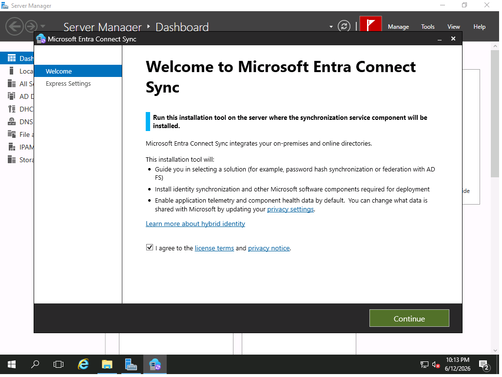
Selected Express Settings
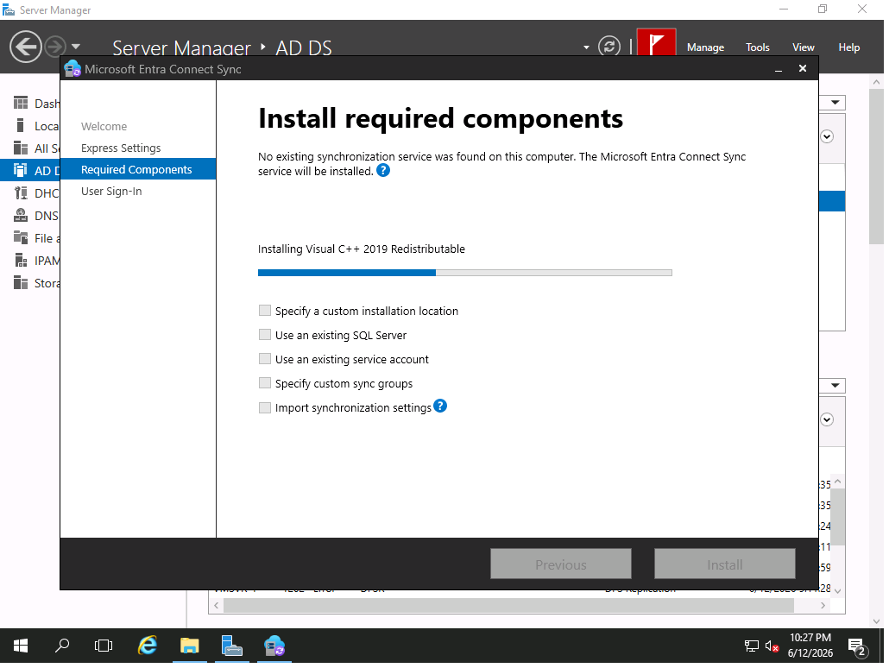
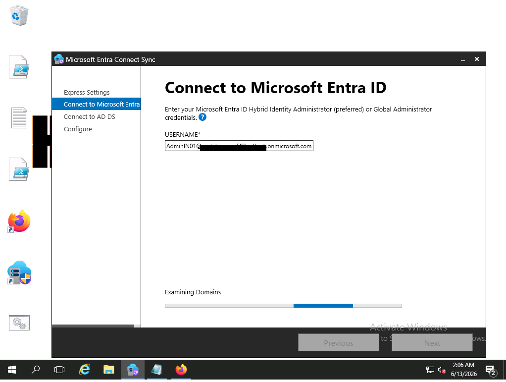
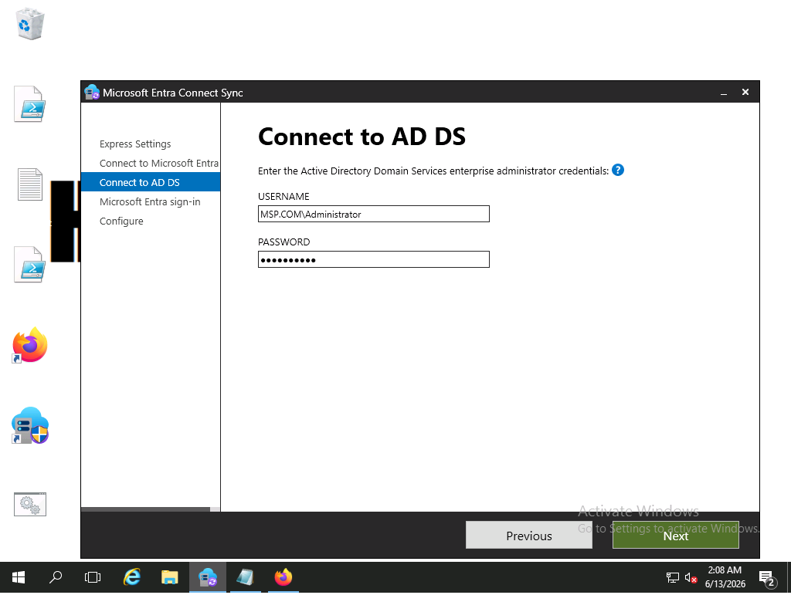

> At this step, you should uncheck  `"Start the syncronization process when configuration completes"` Otherwise this will sync all your objects to the cloud. I skip this as I have to sync all my user right now! I will demonstrate below how you can choose spacific OUs only to sync as well as we will test `attribute based syncronization`

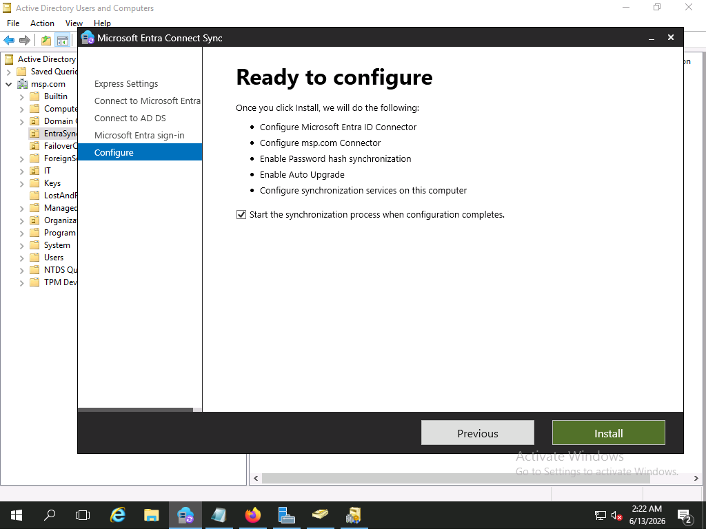

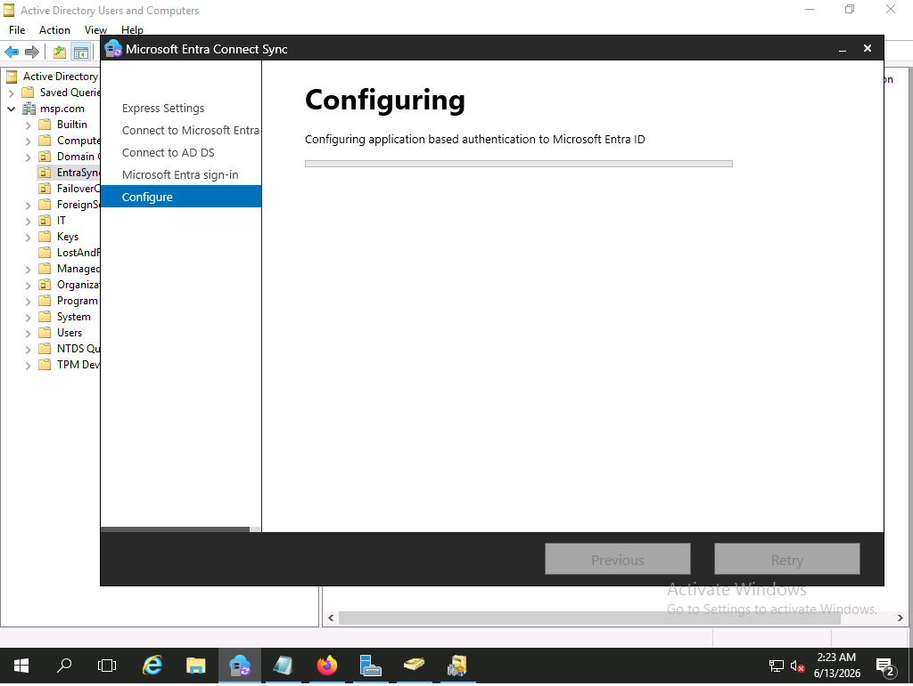
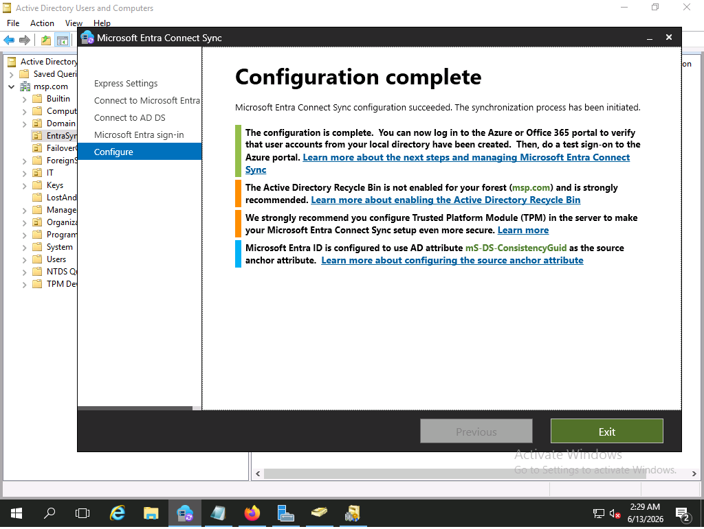

## Custom Syncronization
Above I have performed a straight forward installation but in real life we may not require to sync all users to the cloud instead we use `Custom syncronization methods`

So basically we use OU, Group, domain and user attributes based filtering options to filter users to sync to cloud.

### 1. OUs Based Filtering

On the `Entra Connect Server` Search for Microsoft Entra Connect Sync and open it. 

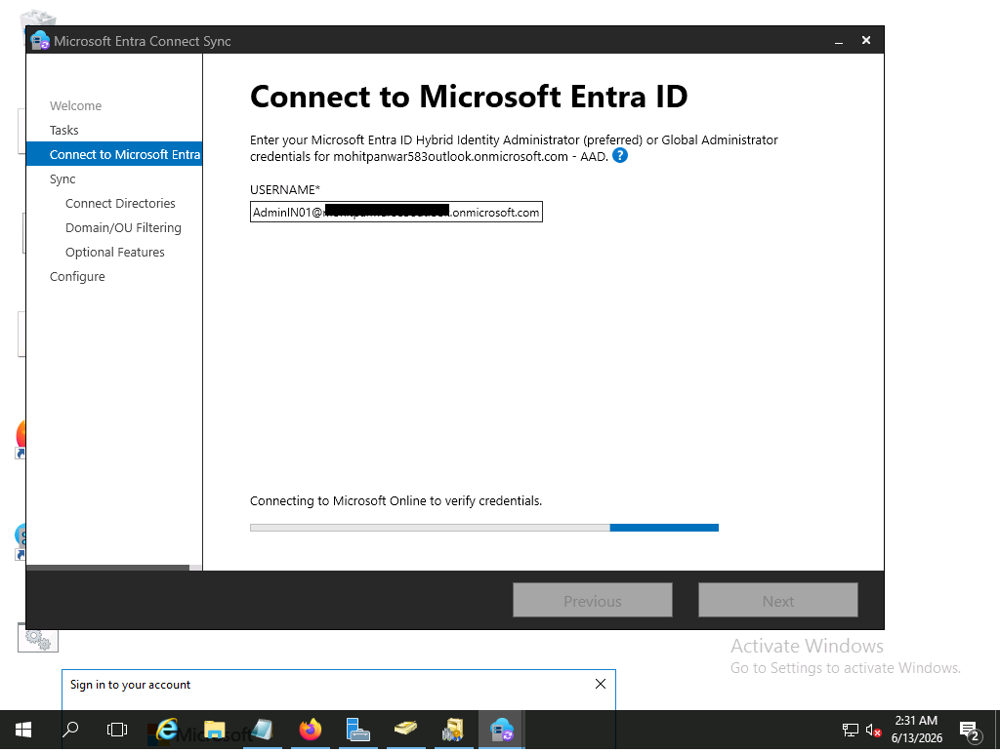
> First you have to create an OU and then here you can spacify that OU, after this only the users located in this OU will sync to cloud, Additionaly you can spacify any domain to sync user from, I have only one domain So I skip it for now.

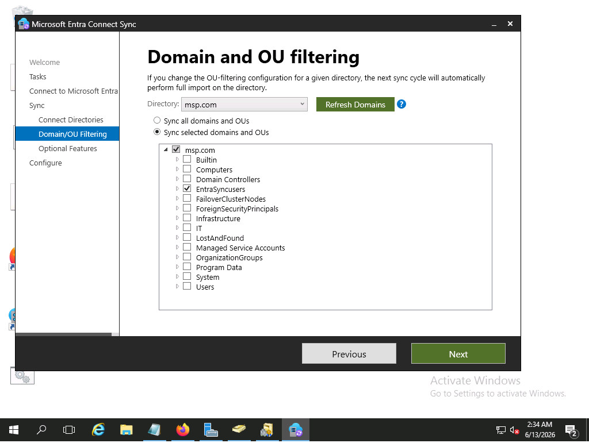
> Under `optional features` you can choose how users password will be sync 

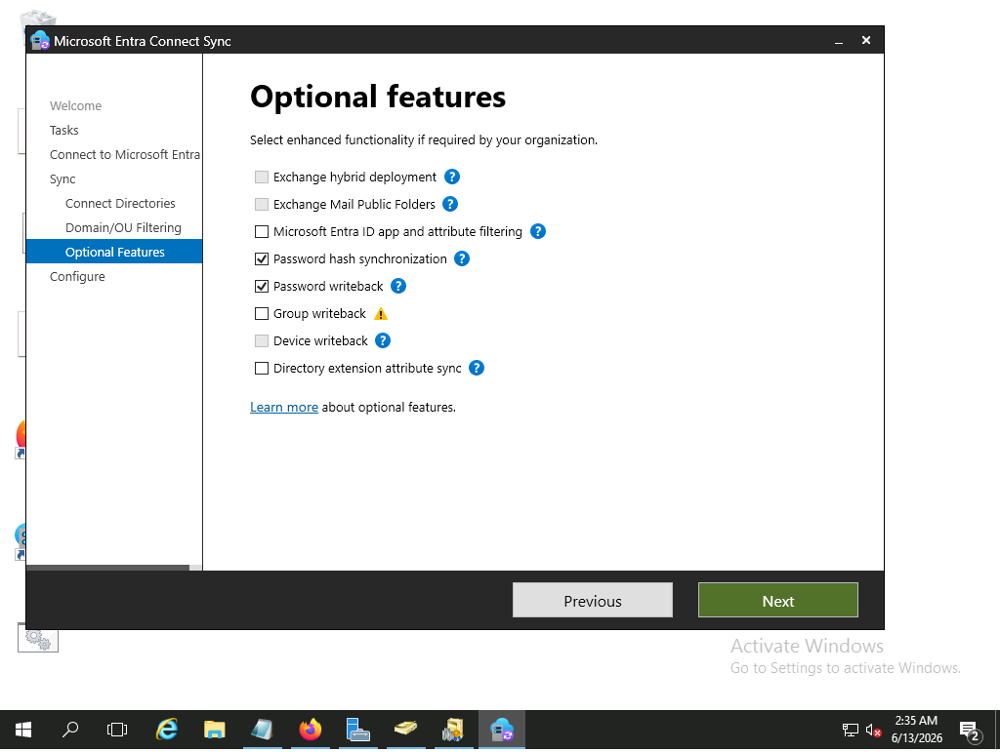
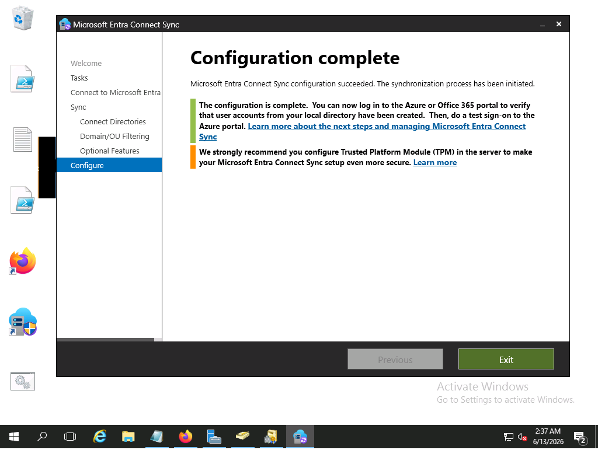
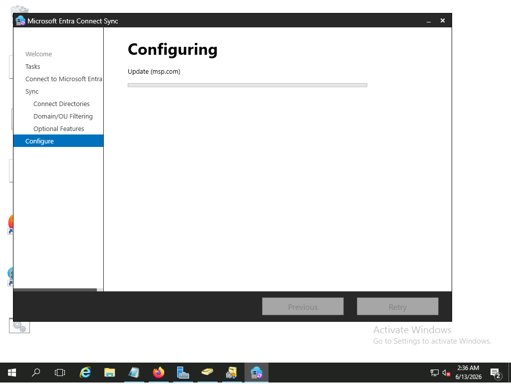
