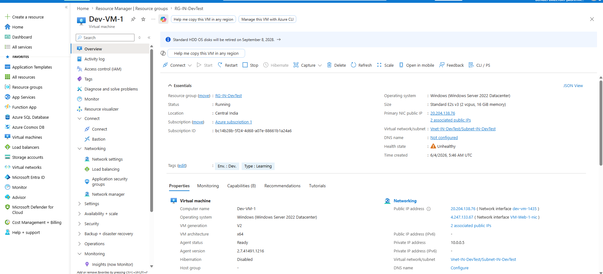
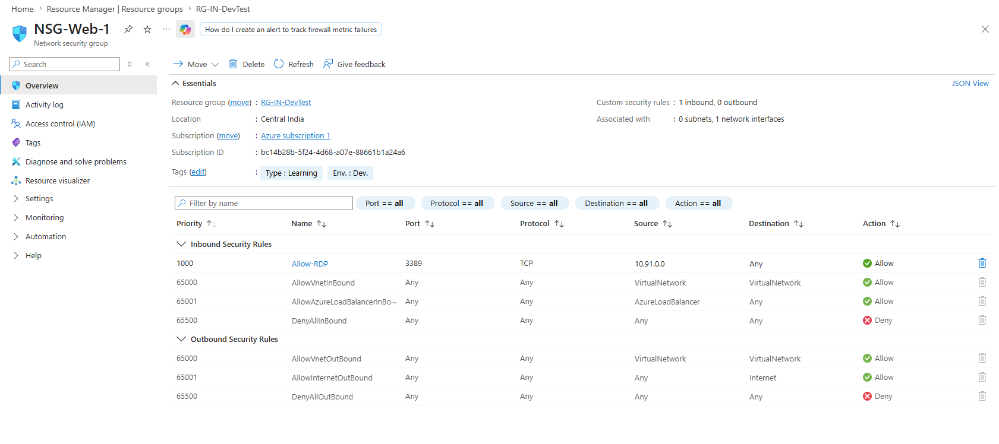
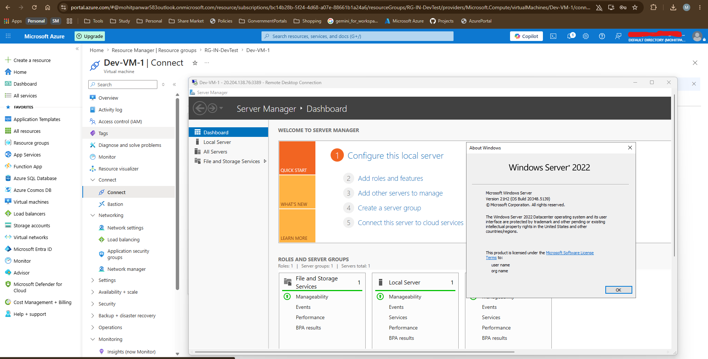
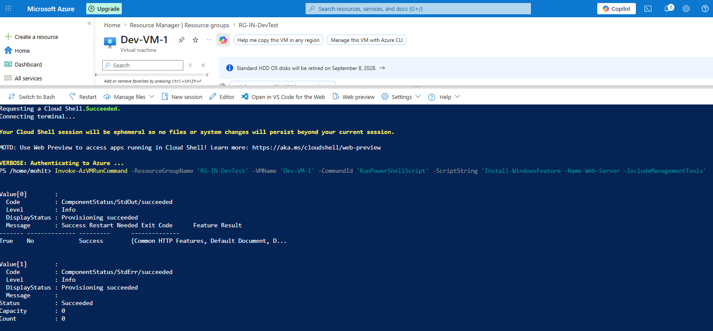
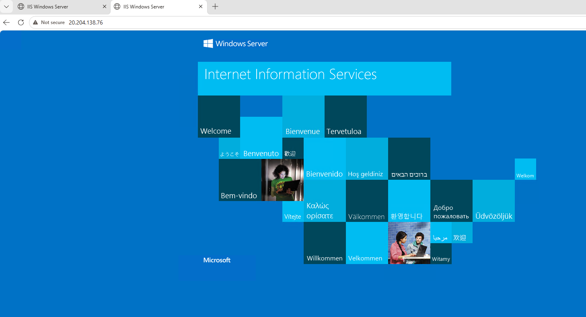
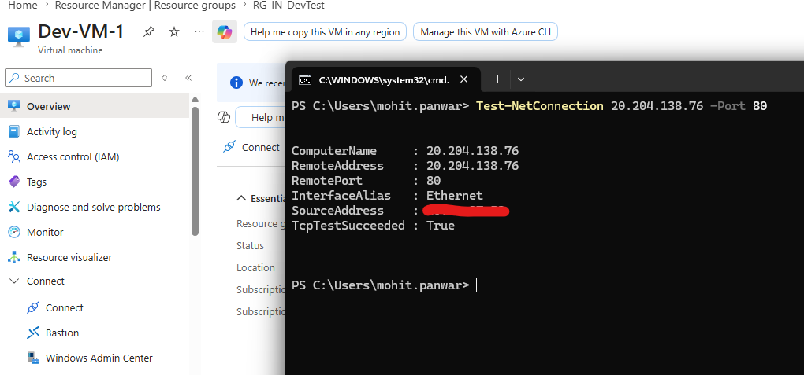

## Objective
To deploy and configure a secure Azure Virtual Machine for hosting enterprise workloads.

## Architecture
Azure Resource Group → Virtual Network → Subnet → Network Security Group → Virtual Machine → Public IP → Azure Bastion or RDP

## Steps Performed
* Created Resource Group and Virtual Network with subnet configuration
* Deployed Windows Server VM in Azure using [Az PowerShell Script](./NewAzVM.ps1)
* Configured NSG rules to allow secure RDP access (port 3389)
* Assigned Public IP and connected via Remote Desktop
* Installed IIS Web Server for testing
* Configured Azure Backup for VM

## Tools Used
`Azure Portal` `Azure Virtual Machines` `NSG` `RDP` `IIS Server` `Azure Backup` `Azure PowerShell`

## Outcome
Successfully deployed a secure and accessible cloud-based virtual machine with proper access control and backup, demonstrating Azure infrastructure management skills.

