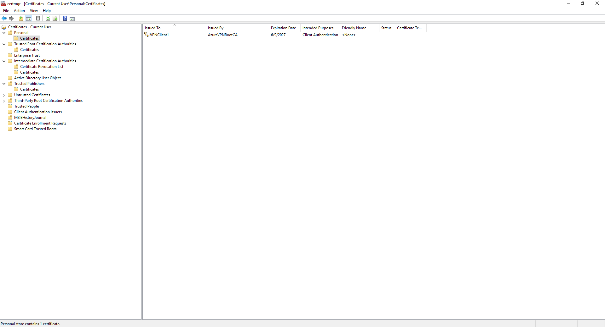
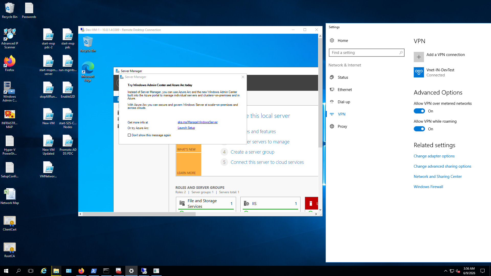
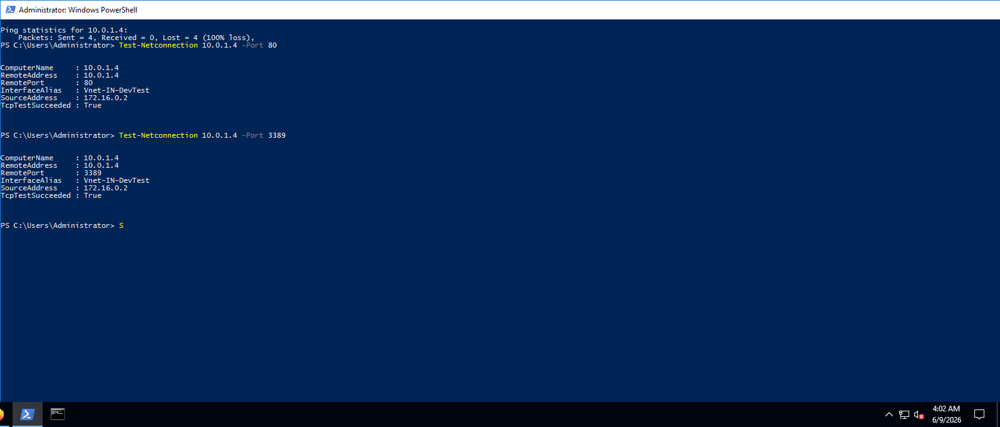
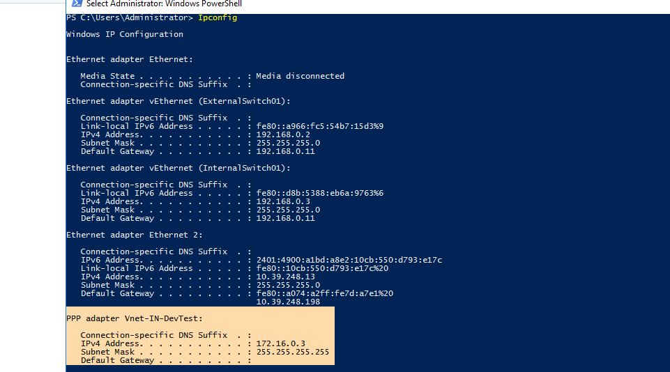

# Azure VNet with VPN Connectivity Implementation Documentation

## Objective
The goal of this project is to establish a secure, reliable, and scalable hybrid networking environment. It connects an `on-premises network` and `Remote administrator` to an `Azure Virtual Network (VNet)` using a `Route-Based Site-to-Site (S2S) and point-to-Site (S2S) VPN gateway` This ensures encrypted cross-premises communication over the public internet, allowing secure cloud resource management and seamless workload migration.

## Architecture 📐

The hybrid architecture utilizes a Hub-and-Spoke topology foundation, consisting of the following key components:
### Vnet 🖧 and Virtual Network Getway 
*   **Azure VNet (`Vnet-IN-DevTest`):** Address space `10.0.0.0/24` located in the IN Central region.
*   **Production Subnet (`Subnet-DevTest-Apps`):** Address space `10.0.1.0/28` hosting core cloud workloads for e.g., `Virtul Machines`.
*   **Gateway Subnet (`GatewaySubnet`):** Dedicated address space `10.1.0.0/27` required to host the Virtual Network Gateway.
*   **Virtual Network Gateway (`VNG-DevTest-Hub`):** VpnGw2 SKU, route-based generation 2, utilizing a standard Public IP address named `VNG-DevTest-PubIP`.
### S2S VPN - In Progress
*   **Dynamic BGP Routing Integration:** Configured dynamic route propagation using Azure Private ASN (65515) alongside Custom APIPA BGP Peer address mappings (`169.254.x.x`) to resolve cross-          premises IP translation conflicts.
*   **Local Network Gateway (`LNG-OnPrem-HQ`):** Represents the physical on-premises network object in Azure, referencing the on-premises public IP (``) and local address space (`10.91.0.0/16`).
*   **VPN Connection (`Conn-Hub-To-OnPrem`):** IPSec/IKEv2 tunnel secured via a Pre-Shared Key (PSK).
*   **On-Premises Gateway:** You can use Enterprise-grade firewall/router I am using `Windows Server RRAS VPN` configured with matching IPSec parameters.

### P2S VPN
*   **VPN Profile Configuration** Point-to-Site Configuration with `Address space: 172.16.0.0/24` "It must be different from the Vnet adress spaces and the on-prem network address spaces.", `Tunnel type: IKEv2 and SSTP (SSL)` and `Authentication type: Azure certificate` used `SelfSigned Certificated`


## Performed Steps ⚡

### Phase 1: Azure Network Infrastructure Provisioning
1.  **Created the Virtual Network:** Deployed `Vnet-IN-DevTest ` with the address block `10.0.0.0/24`.
2.  **Provisioned Workload Subnet:** Carved out `Subnet-DevTest-Apps` (`10.0.1.0/24`) and attached a custom Network Security Group (NSG) to restrict inbound traffic to authorized blocks.
3.  **Provisioned Gateway Subnet:** Allocated the exact designation `GatewaySubnet` with a `/24` prefix (`10.0.254.0/24`) to accommodate gateway routing mechanics.

### Phase 2: Site-to-Site VPN Deployment
1.  **Deployed Virtual Network Gateway:** Created `VNG-DevTest-Hub`, binding it to the `GatewaySubnet` and Getway public IP`VNG-DevTest-PubIP`. Configured it as a `Route-Based VPN` with `VpnGw1 SKU`.
2.  **Configured Local Network Gateway:** Created `LNG-OnPrem-HQ` matching the on-premises edge router's public IP address and declared local subnets.
3.  **Established Connection Resource:** Created `Conn-Hub-To-OnPrem` linking the Virtual Network Gateway and Local Network Gateway. Selected Site-to-Site (IPSec) connection type and generated a high-entropy 32-character Pre-Shared Key.

### Phase 3: On-Premises Configuration & Activation - In progress
1.  **Downloaded Configuration Script:**
2.  **Configured Edge Router:**
3.  **Configured Routing:**

### Phase 4: Site-to-Site VPN Validation and Testing - In progress
1.  **Tunnel Verification:**
2.  **ICMP Connectivity Testing:**
3.  **Path Traversal Validation:**

### Phase 5: Point-to-Site VPN Deployment
1. **Profile Deployment:** On the `VNG-DevTest-Hub` under Point-to-Site Configuration tab, I configured Address spaces for VPN P2S Clients `Address space: 172.16.0.0/24`, Choosed `Tunnel type: IKEv2 and SSTP (SSL)` and `Authentication type: Azure certificate` I used SelfSigned Certificated for authentication.
2. **Generated SelfSigned Certificates:** Used Powershell Script and added the certificates on `Point-to-Site Configuration tab > Root Certificates`

```
# RootCA 
$rootCert = New-SelfSignedCertificate -Type Custom -KeySpec Signature `
-Subject "CN=MohitAzureVPNRootCA" -KeyExportPolicy Exportable `
-HashAlgorithm sha256 -KeyLength 2048 `
-CertStoreLocation "Cert:\CurrentUser\My" `
-KeyUsageProperty Sign -KeyUsage CertSign


#Client Certificate

New-SelfSignedCertificate -Type Custom -DnsName "Mohit-personalLaptop" `
-KeySpec Signature -KeyExportPolicy Exportable `
-HashAlgorithm sha256 -KeyLength 2048 `
-CertStoreLocation "Cert:\CurrentUser\My" `
-Signer $rootCert -TextExtension @("2.5.29.37={text}1.3.6.1.5.5.7.3.2")
```

4. **Downloaded VPN Profile:** After successfull save, I downloaded the file and transfered on the client machine. 
 

### Phase 5: Configured point-to-Site VPN client on Local Machine
1. **Configured VPN:** Opened download `VPN Profile Zip file`, and navigate to `WindowsAmd64 folder` and run the application - it automatically added `VPN network adepter` into the machine
2. **Import Certificate:** I ensured that the Client Certificate are imported on `Cert:\CurrentUser\My` the machine and showsing status
   
4. **Connect VPN Client:** I go to network adepter > Select VPN Network Adpeter > and clicked on connect. - it successfully connected.


### Phase 4: Point-to-Site VPN Validation and Testing
1.  **VM Connectivity Check: I run Test-Netconnection cmdlet on local machine and get successfull results
2.  
3.  **RDP of VM hosted on Azure: I used RDP to connect Az VM deployed in Azure VNet (`Vnet-IN-DevTest`)
   




## Outcome
Built a secure hybrid network that connects both office datacenters `(via Site-to-Site VPN)` and remote users working from home `(via Point-to-Site VPN)` straight to Azure. By deploying both `Site-to-Site and` `Point-to-Site VPNs`, IT teams and remote administrators can securely manage cloud workloads using private internal IPs—meaning no public endpoints are ever exposed to the internet. It keeps data encrypted and compliant, while creating a scalable foundation that’s ready to grow into a larger `hub-and-spoke network`


#Diagram of Azure Site-to-Site VPN

```
+-------------------------------------------------------------------------------------------------+

|                                       MICROSOFT AZURE                                           |
|                                                                                                 |
|  +--------------------------------------- RESOURCE GROUP ------------------------------------+  |
|  |                                                                                           |  |
|  |   +--------------------------------- VIRTUAL NETWORK (VNet) --------------------------+   |  |
|  |   |                                                                                   |   |  |
|  |   |   +--------------------------+                 +------------------------------+   |  |
|  |   |   |      GatewaySubnet       |                 |        Workload Subnet       |   |  |
|  |   |   |       (e.g., /27)        |                 |          (e.g., /24)         |   |  |
|  |   |   |                          |                 |                              |   |  |
|  |   |   |  [VirtualNetworkGateway] |                 |   [Azure VM / Resources]     |   |  |
|  |   |   +------------+-------------+                 +--------------+---------------+   |  |
|  |   |                |                                              |                   |   |  |
|  |   +----------------|----------------------------------------------|-------------------+   |  |
|  |                    |                                              |                   |  |
|  |             +------+------+                                       |                   |  |
|  |             |  Public IP  |                                       |                   |  |
|  |             +------+------+                                       |                   |  |
|  |                    |                                              |                   |  |
|  |             [ Connection ] <------- (Links Azure Gateway & LNG)  |                   |  |
|  |                    |                                                                  |  |
|  |          [LocalNetworkGateway] <--- (Represents On-Premises IP & Subnets)             |  |
|  +--------------------+----------------------------------------------------------------------+  |
+-----------------------|-------------------------------------------------------------------------+
                        |
                        | ==================================================
                        |  IPsec / IKE VPN Tunnel (Encrypted via Internet)
                        | ==================================================
                        |
+-----------------------|-------------------------------------------------------------------------+

|                       |               ON-PREMISES NETWORKING                                    |
|                       |                                                                         |
|                +------+------+                                                                  |
|                |  Edge Router|  <---- (On-Premises VPN Device with Public IP Address)           |
|                +------+------+                                                                  |
|                       |                                                                         |
|         +-------------+-------------+                                                           |
|         |    Local LAN Subnets      |  <---- (Internal Networks, e.g., 192.168.1.0/24)          |
|         +---------------------------+                                                           |
+-------------------------------------------------------------------------------------------------+

```

